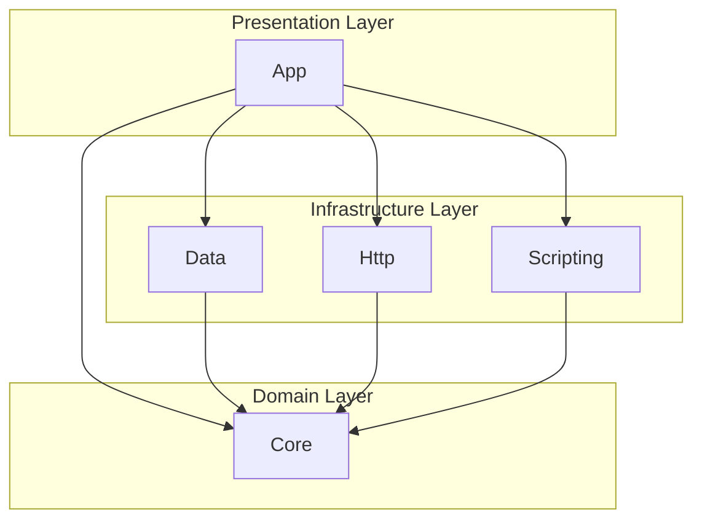
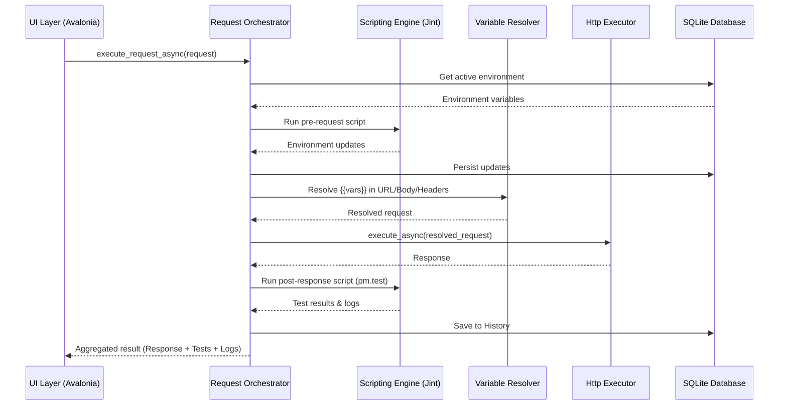

# API RIG

API RIG is a powerful, cross-platform desktop application built with .NET 10 and Avalonia UI. It provides a comprehensive environment for developing, testing, and managing HTTP requests, mimicking the core functionality of Postman with a focus on performance and extensibility.

## Features

- **HTTP Request Execution**: Support for all standard HTTP methods (GET, POST, PUT, DELETE, etc.) with customizable headers, query parameters, and body types (JSON, Form-Data, x-www-form-urlencoded, Raw).
- **Collection Management**: Organize your requests into collections and folders. Import and export Postman v2.1 collections for seamless interoperability.
- **Environment Variables**: Manage multiple environments and use `{{variable}}` syntax to resolve dynamic values in your requests.
- **Scripting Engine**: Integrated JavaScript engine (Jint) for pre-request and post-response (testing) scripts.
- **Automated Testing**: Built-in `pm.*` API for assertions and test results directly in the UI.
- **Request History**: Automatic persistence of executed requests and responses in a local SQLite database.
- **Authentication**: Native support for Basic Auth, Bearer Token, API Key, and OAuth2 Client Credentials.

## Project Structure

The solution is organized into modular projects to ensure separation of concerns and maintainability:

- **App**: The main UI layer built with Avalonia UI, implementing the MVVM pattern.
- **Core**: Contains shared models, interfaces, and core abstractions used across the solution.
- **Http**: Responsible for request execution and authentication handling using `HttpClient`.
- **Data**: Manages data persistence using EF Core and SQLite, including collection parsing and environment management.
- **Scripting**: Encapsulates the JavaScript execution environment and the `pm.*` API implementation.

## Architecture

The following diagram shows the project dependencies and how the different modules communicate:



## Execution Flow

The following diagram illustrates the complete flow of a request execution, from the UI trigger to the final response and test results:



## How to Build and Run

### Prerequisites

- .NET SDK 10.x installed
- Git

### Verify Installation

```bash
dotnet --version  # Should return 10.*
```

### Clone and Build

```bash
git clone <repository-url>
cd api_rig
dotnet restore
dotnet build -c Release
```

### Run Tests

```bash
dotnet test -c Release
```

### Run the Application

To run the desktop application in Release mode:

```bash
dotnet run --project src/App/App.csproj -c Release
```

### Run All Tests with Verbose Output

```bash
dotnet test -c Release --logger "console;verbosity=detailed"
```

## Project History

This project was initially planned as a collaborative AI-assisted session. Below is the original project description, team, and planning phase:

### Original Description
A cross-platform Postman clone. Import Postman collections, execute requests, manage environments, run pre/post scripts with assertions, track history.

### Team
- Amlan
- Ankur
- Juan
- Edwar

### Estimated Time
6 hours, 4 people = 24 person-hours

### Tech Stack
- .NET 10
- Avalonia 11 (Fluent theme)
- EF Core + SQLite
- Jint (JavaScript engine)
- Newtonsoft.Json

### Initial Planning & Requirements
The project was structured around high-priority features like collection imports, HTTP execution, and a robust scripting API compatible with Postman's `pm.*` syntax.

#### Isolation Rules
1. Define interfaces in Core first — lock them before implementation starts
2. Each person owns one project — no cross-edits
3. UI developer works against interfaces using mocks until real implementations merge
4. One branch per project, merge Core first

#### Merge Order
1. Core (models + interfaces)
2. Data
3. Http
4. Scripting
5. UI (iterative)

#### Coding Standards
- snake_case for all identifiers
- Async suffix: `_async`
- CancellationToken on all async methods
- Minimal comments — only for non-obvious logic
- MIT license

### Tickets

#### Core
- CORE-001: Solution scaffold
- CORE-002: Request/response models
- CORE-003: Collection models
- CORE-004: Auth models
- CORE-005: History models
- CORE-006: Environment models
- CORE-007: Script context/result models
- CORE-008: Interface definitions

#### Http
- HTTP-001: Request executor
- HTTP-002: Basic auth
- HTTP-003: Bearer auth
- HTTP-004: API Key auth
- HTTP-005: OAuth2 Client Credentials
- HTTP-006: Response processing
- HTTP-007: Timeout and cancellation

#### Data
- DATA-001: SQLite schema and DbContext
- DATA-002: History repository
- DATA-003: Collection repository
- DATA-004: Environment store with variable resolution
- DATA-005: Postman v2.0 parser
- DATA-006: Postman v2.1 parser
- DATA-007: Collection export

#### Scripting
- SCRIPT-001: Jint engine setup with sandbox
- SCRIPT-002: pm.test() implementation
- SCRIPT-003: pm.expect() assertions
- SCRIPT-004: pm.response object
- SCRIPT-005: pm.request object
- SCRIPT-006: pm.environment get/set
- SCRIPT-007: Pre-request script runner
- SCRIPT-008: Post-response script runner

#### UI
- UI-001: App shell and navigation
- UI-002: Request builder panel
- UI-003: Response viewer panel
- UI-004: Collection tree view
- UI-005: History list
- UI-006: Environment selector
- UI-007: Script editor panels
- UI-008: Test results display
- UI-009: Import/export dialogs
- UI-010: Wire up DI and real services

#### Integration
- INT-001: End-to-end request flow
- INT-002: Collection import to execution
- INT-003: Environment variable substitution
- INT-004: Full script execution flow

### Hour-by-Hour Focus

| Hour | Focus |
|------|-------|
| 0–1 | Setup, agree on interfaces, scaffold |
| 1–3 | TDD + implementation (parallel) |
| 3–4 | Integration, wire UI to real services |
| 4–5 | Polish, edge cases, error handling |
| 5–6 | Testing, bug fixes, demo prep |
